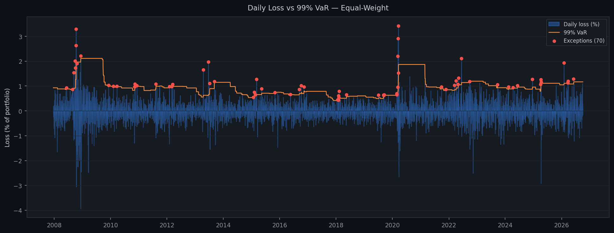
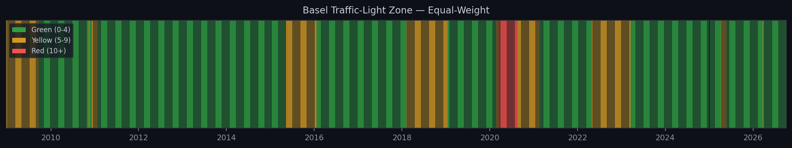
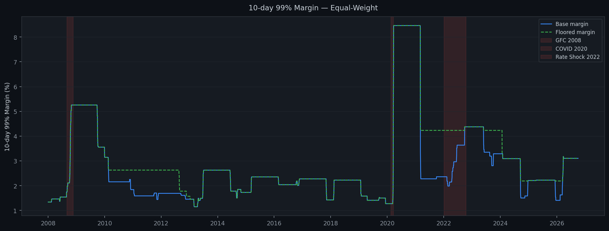
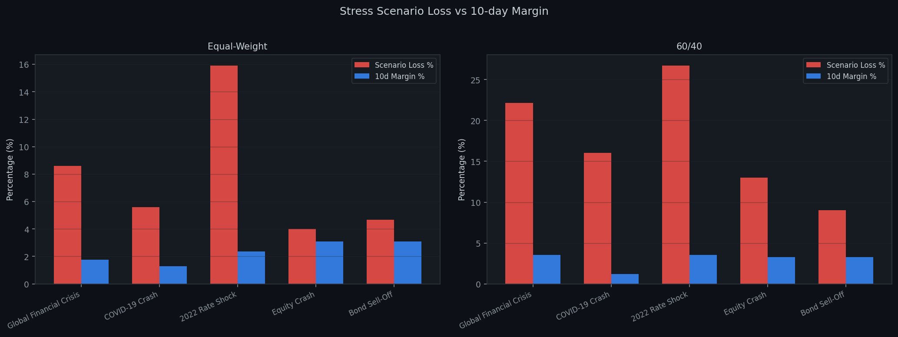

# Market Risk & Margin Back-Testing Framework

A Python project that estimates and back-tests **historical Value-at-Risk (VaR)** and **Expected Shortfall (ES)**, sets a simple **VaR-based initial margin**, and stress-tests two portfolios with historical crisis replays and fixed-percentage shocks

---

## What it does

1. **Historical VaR and Expected Shortfall** (1-day, 99%) on a rolling 250-day window.
2. **Back-testing**: counts days when the real loss was bigger than the VaR forecast ("exceptions") and applies the Basel traffic-light zones.
3. **Initial margin**: a 10-day 99% VaR-based margin, tested for how often it fails, plus a "floor" variant that limits how fast margin can fall.
4. **Stress testing**: replays of three real crises and two simple hypothetical shocks, compared against the margin held.

**Assets:** SPY (US equity), TLT (long Treasuries), LQD (investment-grade credit), GLD (gold), EURUSD, USDINR.
**Portfolios:** Equal-weight (all six assets) and 60/40 (60% SPY, 40% TLT).
**Period:** forecasts from 2008 to 2026, 4,884 test days. Data from Yahoo Finance via `yfinance`.

---

## How to run

```
# 1. Install dependencies
pip install -r requirements.txt

# 2. Run the full pipeline (downloads data on the first run, then uses the cache)
python run_pipeline.py

# 3. Run tests
pytest tests/ -v

# 4. Open the results notebook
jupyter notebook notebooks/results_walkthrough.ipynb
```

Outputs: `results/risk_report.xlsx` (five sheets) and `results/charts/` (PNG charts).

---

## Project structure

```
var-backtesting/
├── config.yaml              # all parameters
├── requirements.txt
├── run_pipeline.py          # single entry point
├── src/
│   ├── data_loader.py       # download, cache, clean prices
│   ├── var_models.py        # historical VaR and ES
│   ├── backtest.py          # exception counting, traffic light
│   ├── margin.py            # 10-day margin, floor variant
│   ├── stress.py            # historical replays and hypothetical shocks
│   ├── charts.py            # chart generation
│   └── report.py            # Excel report writer
├── tests/
│   └── test_var_models.py
├── notebooks/
│   └── results_walkthrough.ipynb
└── results/
    ├── risk_report.xlsx
    └── charts/
```

---

## Method

**Returns and losses.** Daily return = today's price / yesterday's price - 1. A loss is the negative of a return, and VaR and ES are always shown as positive percentages.

**Historical VaR.** Sort the last 250 daily losses. The 99th percentile is the VaR: on 99 out of 100 days in that window the loss was smaller. Nothing is assumed about the shape of returns. The forecast for day *t* only uses data up to day *t - 1* (no look-ahead).

**Expected Shortfall.** The average of the losses that were worse than the VaR. It answers: "when we do breach VaR, how bad is it on average?"

**Back-testing.** An exception is a day when the real loss was bigger than that day's VaR forecast. At 99% confidence we expect about 1% of days to be exceptions. The Basel traffic light counts exceptions in each rolling 250-day window: 0-4 green, 5-9 yellow, 10+ red.

**Initial margin.** The 99% VaR of overlapping 10-day losses from the last 250 days. It is back-tested by checking how often the real loss over the next 10 days was bigger than the margin. The floor variant never lets margin fall below 50% of its highest level in the previous three years, which reduces procyclicality.

**Stress testing.** Historical replays apply the actual returns from GFC (2 Sep - 20 Nov 2008), COVID (19 Feb - 23 Mar 2020) and the 2022 rate shock (3 Jan - 14 Oct 2022) to today's portfolio weights. The hypothetical shocks are fixed percentage moves defined in `config.yaml`.

---

## Results

### 1-day 99% VaR and Expected Shortfall (latest day in the sample)

| Series | VaR | ES |
| --- | --- | --- |
| SPY | 1.75% | 2.13% |
| TLT | 1.53% | 1.71% |
| LQD | 0.86% | 1.09% |
| GLD | 4.41% | 7.05% |
| EURUSD | 0.76% | 0.88% |
| USDINR | 1.34% | 1.91% |
| Equal-weight | 1.17% | 1.48% |
| 60/40 | 1.60% | 1.71% |

Diversification: the equal-weight portfolio VaR is about 34% below the weighted sum of its assets' VaRs. For 60/40 it is only about 4% below, because stocks and bonds are only partly offsetting.

### Back-testing (4,884 test days, expected exception rate 1%)

| Series | Exceptions | Rate | Green | Yellow | Red |
| --- | --- | --- | --- | --- | --- |
| SPY | 76 | 1.56% | 63.1% | 29.1% | 7.9% |
| TLT | 72 | 1.47% | 74.1% | 23.3% | 2.5% |
| LQD | 74 | 1.52% | 66.5% | 26.4% | 7.1% |
| GLD | 70 | 1.43% | 67.2% | 32.8% | 0.0% |
| EURUSD | 70 | 1.43% | 65.4% | 34.0% | 0.7% |
| USDINR | 78 | 1.60% | 65.1% | 25.5% | 9.4% |
| Equal-weight | 70 | 1.43% | 74.5% | 23.0% | 2.4% |
| 60/40 | 74 | 1.52% | 66.3% | 26.7% | 7.0% |

Zones are measured on rolling 250-day windows, so they start in late 2008.




### 10-day 99% initial margin (target breach rate 1%)

| Series | Breach rate (base) | Breach rate (floor) | Avg margin (base) | Avg margin (floor) |
| --- | --- | --- | --- | --- |
| SPY | 2.65% | 1.67% | 8.28% | 9.51% |
| TLT | 1.99% | 1.89% | 5.60% | 5.64% |
| LQD | 2.67% | 1.79% | 3.89% | 4.91% |
| GLD | 2.43% | 2.30% | 7.19% | 7.36% |
| EURUSD | 2.80% | 2.22% | 3.82% | 3.90% |
| USDINR | 2.22% | 1.83% | 2.75% | 2.87% |
| Equal-weight | 2.63% | 1.99% | 2.73% | 3.03% |
| 60/40 | 2.69% | 1.91% | 4.94% | 5.64% |

**Procyclicality** (margin just before a crisis vs its peak):

| Portfolio | Event | Before | Peak | Multiple |
| --- | --- | --- | --- | --- |
| Equal-weight | GFC 2008 | 1.75% | 5.26% | 3.0x |
| Equal-weight | COVID 2020 | 1.27% | 8.46% | 6.7x |
| 60/40 | GFC 2008 | 3.54% | 12.32% | 3.5x |
| 60/40 | COVID 2020 | 1.21% | 13.11% | 10.8x |



### Stress testing

| Portfolio | Scenario | Loss | Multiple of 1-day VaR | Margin before | Covered? |
| --- | --- | --- | --- | --- | --- |
| Equal-weight | GFC 2008 | 8.58% | 9.8x | 1.75% | No |
| Equal-weight | COVID 2020 | 5.58% | 8.9x | 1.27% | No |
| Equal-weight | 2022 rate shock | 15.91% | 18.7x | 2.36% | No |
| 60/40 | GFC 2008 | 22.13% | 16.1x | 3.54% | No |
| 60/40 | COVID 2020 | 16.02% | 16.0x | 1.21% | No |
| 60/40 | 2022 rate shock | 26.73% | 17.0x | 3.53% | No |
| Equal-weight | Equity crash (illustrative) | 4.00% | 3.4x | 3.10% | No |
| Equal-weight | Bond sell-off (illustrative) | 4.67% | 4.0x | 3.10% | No |
| 60/40 | Equity crash (illustrative) | 13.00% | 8.1x | 3.28% | No |
| 60/40 | Bond sell-off (illustrative) | 9.00% | 5.6x | 3.28% | No |



---

## What the results show

- **Exception rates are above 1% for every series (1.4% to 1.6%).** A 99% VaR from only 250 days rests on the 2nd or 3rd worst day, so it is noisy and slow to react. Exceptions arrive in bursts at the start of volatile periods, before the window has "seen" the new volatility.
- **Equal-weight spends most of its time in the green zone (74.5%)** and is red only from March to August 2020. **60/40 is red in 2009 and again from mid-2022 to early 2023**, when stocks and bonds fell together and the usual diversification failed.
- **The 10-day margin breaches about 2.6% of the time against a 1% target.** Overlapping 10-day returns in a 250-day window give only about 25 independent observations, and volatility clusters, so a margin set from the past year is too low just when markets turn.
- **Margin is procyclical.** It rose 3x to 11x within weeks of the 2008 and 2020 crises, which is when firms can least afford to post more collateral.
- **The floor variant helps, but only partly.** It cut breach rates by about 24% (equal-weight) to 29% (60/40), at the cost of 11% to 14% higher average margin, and breaches stayed near 2%.
- **Stress losses exceed margin in every scenario.** They are 9x to 19x the 1-day VaR. Note that the stress windows (five weeks to nine months) are longer than the 10-day margin horizon, so this compares margin with a crisis and is not a strict back-test.

---

